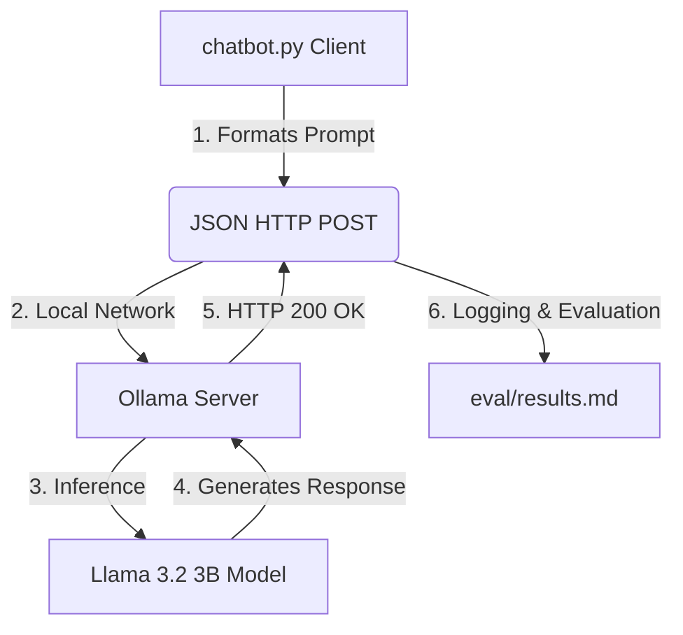

# 🤖 Offline Customer Support Chatbot

### **Secure, Privacy-First AI Automation with Ollama & Llama 3.2**

[](https://opensource.org/licenses/MIT)
[](https://www.python.org/)
[](https://ai.meta.com/llama/)

---

## 📖 Overview
This project demonstrates a production-ready approach to deploying a functional customer support chatbot entirely on local hardware. By leveraging **Ollama** and Meta's **Llama 3.2 (3B)** model, we facilitate high-quality automated interactions without the data privacy risks or recurring costs associated with cloud-based LLM APIs (OpenAI, Google).

### **Why Local LLMs?**
In an era of strict data regulations (**GDPR**, **CCPA**, **DPDP Act 2023**), sending sensitive customer data—names, addresses, and order histories—to third-party servers is a significant liability. This project provides a blueprint for a **zero-data-leakage** solution.

---

## 🏗️ System Architecture
The system follows a unidirectional, synchronous flow where the Python client orchestrates inference via the Ollama REST API.



---

## 🎯 Core Technical Features
- **Prompt Engineering Excellence**: Systematic comparison of **Zero-Shot** vs. **One-Shot** prompting strategies to optimize response tone and persona alignment.
- **Robust Inference Engine**: A custom Python client featuring 90-second request timeouts, automated status code verification, and graceful error handling.
- **Manual Evaluation Framework**: A dedicated 3-axis scoring methodology (Relevance, Coherence, Helpfulness) for precise model calibration.

---

## 📊 Evaluation Methodology
Our benchmarking uses 20 e-commerce support queries adapted from the **Ubuntu Dialogue Corpus**. Each query is tested against two prompt configurations:

| Metric | Definition |
| :--- | :--- |
| **Relevance** | Accuracy in addressing the core customer intent. |
| **Coherence** | Linguistic fluidity and grammatical precision. |
| **Helpfulness** | Actionability of the provided resolution instructions. |

Detailed findings are available in the [**Experiment Report**](report.md).

---

## 📂 Project Structure
```text
offline-chatbot/
├── prompts/           # LLM Instruction Templates
├── eval/              # Raw Inference Logs and Human Scores
├── chatbot.py         # Main Orchestration Engine
├── data_prep.py       # Technical Dataset Adaptation Script
├── report.md          # Comprehensive Performance Analysis
├── setup.md           # Deployment Instructions
└── README.md          # Project Specification
```

---

## 🚀 Quick Start
To get started, follow these steps or see [**setup.md**](setup.md) for full details.

1. **Install Ollama** and pull the model: `ollama pull llama3.2:3b`.
2. **Setup virtual environment**: `python -m venv venv && .\venv\Scripts\activate`.
3. **Install dependencies**: `pip install -r requirements.txt`.
4. **Execute the client**: `python chatbot.py`.

---

## 🛠️ Performance Tuning
- **Timeout Management**: The client is pre-configured with a 90s timeout to accommodate CPU-based inference.
- **Safety Guards**: `chatbot.py` includes a confirmation prompt to prevent accidental data loss of human-scored results.
